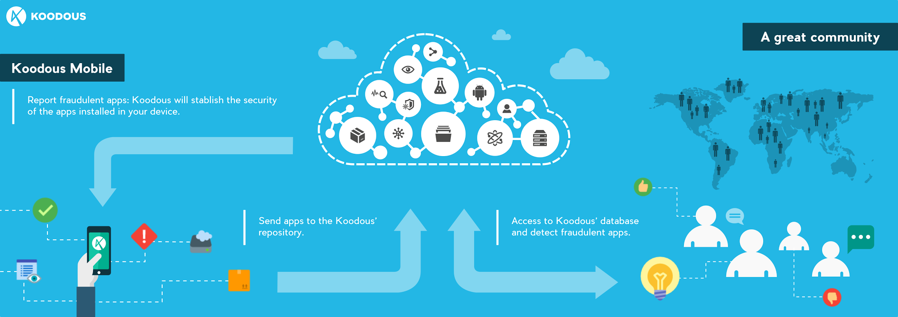
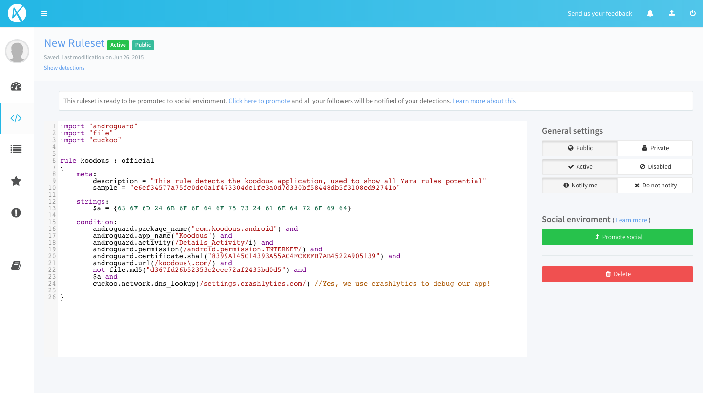
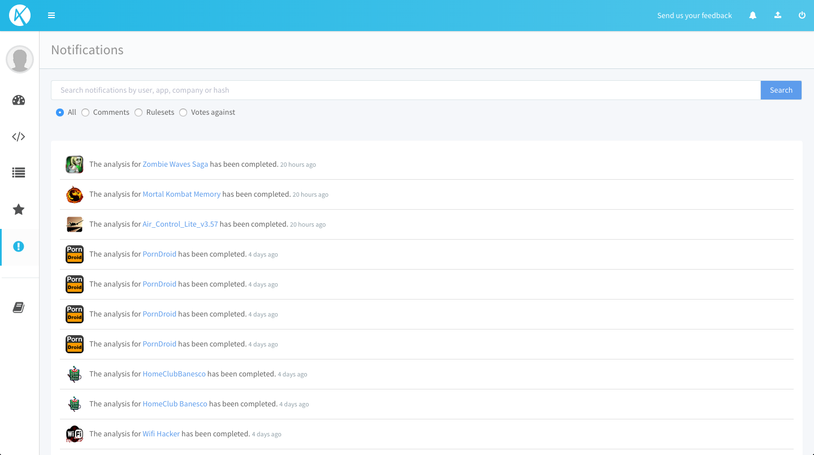

# Koodous Documentation

Koodous is a collaborative platform for Android malware research that combines the power of online analysis tools with social interactions between the analysts over a vast APK repository.

## Write your Yara code

Write your own Yara rules to find interesting Android apps and identify possible threads.

## Android researching

Use our powerful search system to find the APK your are looking for between million of samples.

## Notifications

Get noticed about your detections with our notifications system.

